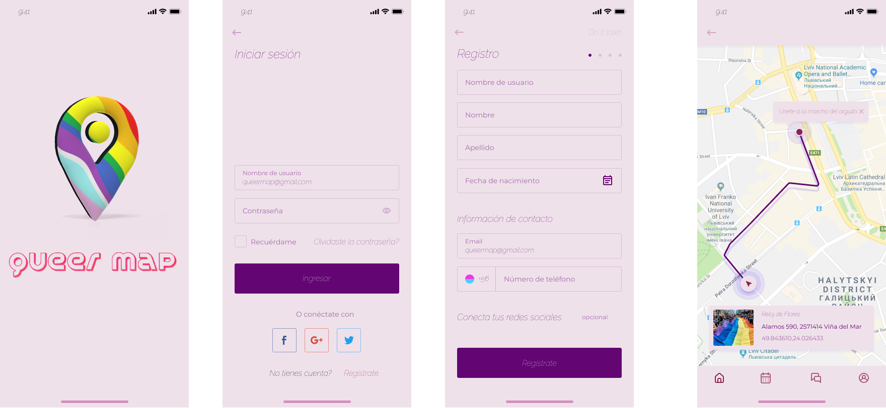

En un mundo donde la diversidad y la inclusión son valores fundamentales, surge Queermap como una herramienta para la comunidad LGBTIQ+. Nuestra aplicación surge de la necesidad de proporcionar espacios seguros y acogedores para todas las personas que se identifican dentro de esta comunidad vibrante y diversa.

El camino hacia la aceptación y el amor propio puede ser desafiante, especialmente cuando se enfrentan obstáculos y discriminación. En Queermap, nos inspira la idea de que todos merecen tener acceso a servicios, entretenimiento, cultura, goce y espacios de salud donde puedan ser ell@s mism@s sin temor al juicio o la exclusión.

  

<b>Detalles de la Aplicación</b>

 

Queermap es una aplicación móvil diseñada específicamente para ayudar a las personas LGBTIQ+ a encontrar lugares seguros y amigables en su área local y en todo el país. Nuestra aplicación ofrece una amplia gama de servicios, incluyendo entretenimiento, cultura, salud, educación, orientación y seguridad.

Comprendemos la importancia de encontrar lugares donde la comunidad LGBTIQ+ pueda expresarse libremente, conectarse con otros miembros de la comunidad y acceder a recursos que promuevan el bienestar y la felicidad. Estamos comprometidos a proporcionar información actualizada y precisa para que cada usuario pueda explorar, experimentar y disfrutar de todo lo que la comunidad tiene para ofrecer.

  

<b>Información sobre la realidad en Chile</b>

 

En Chile, a pesar de los avances legales y sociales, la discriminación y la violencia aún son una realidad para muchas personas de la comunidad. Es importante mencionar algunos aspectos relevantes de la realidad chilena:

- Ley Antidiscriminación: En Chile, existe una Ley Antidiscriminación (Ley N° 20.609) que prohíbe la discriminación arbitraria en diversos ámbitos, incluyendo la orientación sexual e identidad de género.

- Ley de Identidad de Género: La Ley de Identidad de Género (Ley N° 21.120) permite el cambio legal de nombre y género en los documentos oficiales para las personas transgénero mayores de 14 años, sin necesidad de intervención quirúrgica ni autorización judicial.

- Crímenes de odio contra personas pertenecientes a la diversidad sexual y de género: A pesar de los avances legales, los crímenes de odio aún persisten en la sociedad chilena. Es fundamental seguir trabajando para promover la inclusión y el respeto hacia todas las personas.

  

<b>Cluster con las principales problemáticas</b>

 

  

  

<b>Referencias y Recursos</b>

 

  - Fundación Todo Mejora - www.todomejora.org: Prevención del suicidio y discriminación hacia jóvenes LGBT+.
  - OTD (Organizando Trans Diversidades) - www.otdchile.org: Promoción de los derechos de personas trans en Chile.
  - MUMS (Movimiento por la Diversidad Sexual) - www.mums.cl: Promueve la inclusión y la igualdad de derechos para personas LGBTIQ+ en Chile.
  - Agrupación Lésbica Rompiendo el Silencio - www.facebook.com/AgrupacionLesbicaRompiendoElSilencio: Promueve la visibilidad y el empoderamiento de mujeres lesbianas en Chile.
  - Colectiva Lésbica Ayuquelén - www.facebook.com/colectiva.ayuquelen: Espacios de encuentro, reflexión y apoyo para mujeres lesbianas y bisexuales en Chile.
  - Fundación Iguales - www.iguales.cl : Igualdad de derechos para personas LGBTIQ+ en Chile.
  - MOVILH (Movimiento de Integración y Liberación Homosexual) - www.movilh.cl: Lucha por los derechos LGBTIQ+ en Chile.

Recuerda que nuestra aplicación está en constante evolución y mejora. Valoramos tus comentarios y sugerencias para que podamos seguir construyendo un espacio inclusivo y seguro para la comunidad LGBTIQ+.

  

<b>Esta es la historia de Mariana</b>

 

En un rincón de Viña del Mar, una joven lesbiana llamada Mariana buscaba desesperadamente un espacio seguro donde poder ser ella misma, expresar su amor y conectar con otros individuos que compartieran su realidad. Pero se encontró con un muro de discriminación y desconocimiento. Fue entonces cuando descubrió Queermap, un mapa digital que prometía una experiencia transformadora.
Con solo un toque en su pantalla, Mariana se adentró en un mundo de colores vibrantes que reflejaban su identidad y respetaban la diversidad. Encontró una amplia gama de servicios, desde entretenimiento hasta salud y orientación, todo diseñado específicamente para satisfacer las necesidades de la comunidad LGBT+.

Pero Queermap no solo se trataba de encontrar lugares y servicios, sino también de enfrentar desafíos más profundos. La aplicación estaba comprometida con la prevención del suicidio en la comunidad LGBT+ y ofrecía recursos y enlaces a organizaciones que brindaban apoyo y ayuda en momentos difíciles.

Mariana encontró una comunidad que la apoyaba en su viaje personal y juntos desafiaron la discriminación, luchando por la igualdad de derechos. La aplicación se convirtió en un faro de esperanza y en un catalizador para el cambio social, abriendo puertas y corazones en un camino hacia un futuro más inclusivo y respetuoso.

  

<b>Primer acercamiento a la app</b>

 

  1. Registro y perfil de usuario: Crea el login. Los usuarios deben poder registrarse en la aplicación y crear un perfil personalizado.
  2. Funcionalidad principal: Integra el mapa interactivo a la aplicación.

  

<b>Entregas a futuro e ideas a integrar</b>

 

  - El perfil permite guardar los lugares favoritos, unirse a comunidades y recibir recomendaciones personalizadas.
  - Información detallada de los lugares: Cada lugar en el mapa debe tener una página de información detallada que incluya descripción, fotos, horarios, comentarios y calificaciones de otros usuarios. Esto permitirá a los usuarios tomar decisiones informadas sobre los lugares que deseen visitar.
  - Funcionalidades sociales: La aplicación debe incluir funciones sociales que fomenten la interacción entre los usuarios. Esto puede incluir la capacidad de seguir a otros usuarios, dejar comentarios y calificaciones, y compartir lugares en redes sociales.
  - Notificaciones y alertas: La aplicación debe enviar notificaciones y alertas a los usuarios sobre eventos, promociones especiales o actualizaciones relevantes en los lugares que han guardado o en las comunidades a las que se han unido.
  - Facilitar la búsqueda de los usuarios LGBT+ según servicios, entretenimiento, salud y espacios seguros en Chile. Los usuarios deben poder buscar y filtrar los lugares según sus necesidades e intereses.
  - Agregar un botón de emergencia con un número seguro para contención en casos de violencia, crisis o pensamientos suicidas.
  - Demarcar zonas de peligro para la comunidad LGBTIQ+.

Recuerda que nuestra aplicación está en constante evolución y mejora. Valoramos tus comentarios y sugerencias para que podamos seguir construyendo un espacio inclusivo y seguro para la comunidad LGBTIQ+.

### Contacto
Si tienes alguna pregunta, sugerencia o simplemente quieres contactarnos, no dudes en hacerlo a través de nuestros medios de contacto.

¡Gracias por tu apoyo y contribuciones!

