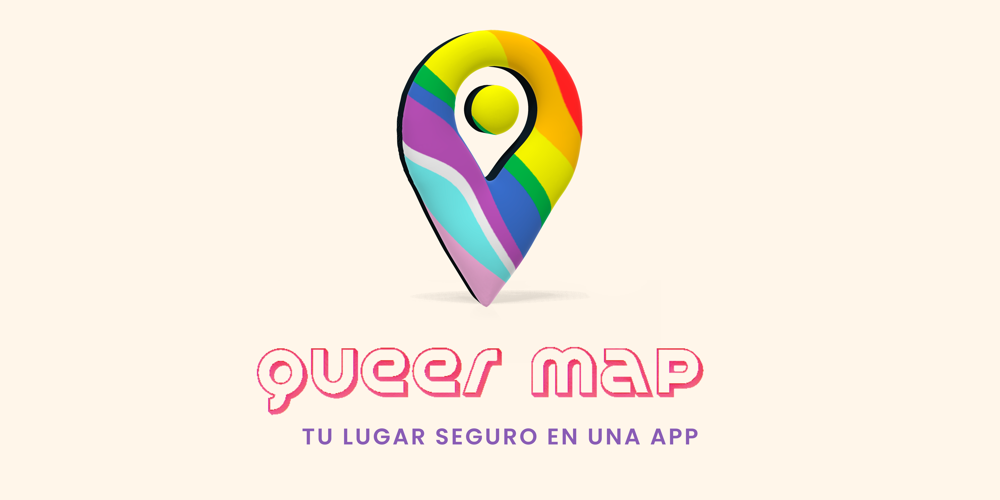

##Storytelling

En un mundo donde la diversidad y la inclusión son valores fundamentales, surge Queermap como una herramienta para la comunidad LGBTIQ+. Nuestra aplicación surge de la necesidad de proporcionar espacios seguros y acogedores para todas las personas que se identifican dentro de esta comunidad vibrante y diversa.

El camino hacia la aceptación y el amor propio puede ser desafiante, especialmente cuando se enfrentan obstáculos y discriminación. En Queermap, nos inspira la idea de que todos merecen tener acceso a servicios, entretenimiento, cultura, goce y espacios de salud donde puedan ser elles mismos sin temor al juicio o la exclusión.

## Detalles de la Aplicación

Queermap es una aplicación móvil diseñada específicamente para ayudar a las personas LGBTIQ+ a encontrar lugares seguros y amigables en su área local y en todo el país. Nuestra aplicación ofrece una amplia gama de servicios, incluyendo entretenimiento, cultura, salud, educación, orientación y seguridad.

Comprendemos la importancia de encontrar lugares donde la comunidad LGBTIQ+ pueda expresarse libremente, conectarse con otros miembros de la comunidad y acceder a recursos que promuevan el bienestar y la felicidad. Estamos comprometidos a proporcionar información actualizada y precisa para que cada usuario pueda explorar, experimentar y disfrutar de todo lo que la comunidad tiene para ofrecer.

## Información sobre la realidad en Chile

En Chile pesar de los avances legales y sociales, la discriminación y la violencia aún son una realidad para muchas personas de la comunidad. Es importante mencionar algunos aspectos relevantes de la realidad chilena:

- **Ley Antidiscriminación**: En Chile, existe una Ley Antidiscriminación (Ley N° 20.609) que prohíbe la discriminación arbitraria en diversos ámbitos, incluyendo la orientación sexual e identidad de género.

- **Ley de Identidad de Género**: La Ley de Identidad de Género (Ley N° 21.120) permite el cambio legal de nombre y género en los documentos oficiales para las personas transgénero mayores de 14 años, sin necesidad de intervención quirúrgica ni autorización judicial.

- **Homofobia y Lesbofobia**: A pesar de los avances legales, la homofobia y la lesbofobia aún persisten en la sociedad chilena. Es fundamental seguir trabajando para promover la inclusión y el respeto hacia todas las personas, independientemente de su orientación sexual o identidad de género.

## Referencias y Recursos

- [Fundación Todo Mejora - www.todomejora.org]: Prevención del suicidio y discriminación hacia jóvenes LGBT+. 

- [OTD (Organizando Trans Diversidades) - www.otdchile.org]: Promoción de los derechos de personas trans en Chile. 

- [MUMS - Movimiento por la Diversidad Sexual - www.mums.cl]: Promueve la inclusión y la igualdad de derechos para personas LGBTIQ+ en Chile. 

- [Agrupación Lésbica Rompiendo el Silencio - www.facebook.com/AgrupacionLesbicaRompiendoElSilencio]: Promueve la visibilidad y empoderamiento de mujeres lesbianas en Chile.

- [Colectiva Lésbica Ayuquelén - www.facebook.com/colectiva.ayuquelen]: Espacios de encuentro, reflexión y apoyo para mujeres lesbianas y bisexuales en Chile. Facebook

- [Fundación Iguales - www.iguales.cl]: Igualdad de derechos para personas LGBTIQ+ en Chile. 

- [Movimiento de Integración y Liberación Homosexual (MOVILH) - www.movilh.cl]: Lucha por los derechos LGBTIQ+ en Chile. 

Recuerda que nuestra aplicación está en constante evolución y mejoramiento. Valoramos tus comentarios y sugerencias para que podamos seguir construyendo un espacio inclusivo y seguro para la comunidad LGBTIQ+.

## 
Contribuciones
¡Nos encantaría recibir tus contribuciones! Si deseas colaborar, por favor sigue los siguientes pasos:

1. Haz un fork del repositorio
2. Crea una rama con un nombre descriptivo: git checkout -b feature/nueva-funcionalidad.
3. Realiza tus cambios y commits: git commit -m "Agrega nueva funcionalidad".
4. Haz un push a tu repositorio: git push origin feature/nueva-funcionalidad.
5. Abre un pull request en este repositorio.
6. Agradecemos cualquier aporte que puedas realizar para mejorar Queermap y hacerlo aún más útil y relevante para la comunidad LGBTIQ+.

Contacto Si tienes alguna pregunta, sugerencia o simplemente quieres contactarnos, no dudes en hacerlo a través de nuestros medios de contacto

Contacto
Si tienes alguna pregunta, sugerencia o simplemente quieres contactarnos, no dudes en hacerlo a través de nuestros medios de contacto

