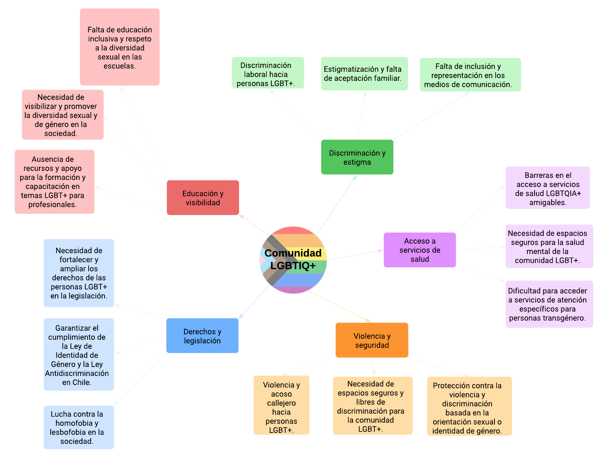

> **Una app que geolocaliza espacios seguros, culturales, de salud, y de ocio para la comunidad LGBTIQ+ en Chile.**

---

En un mundo donde la diversidad y la inclusión son valores fundamentales, surge **Queermap** como una herramienta útil y transformadora para la comunidad LGBTIQ+. Esta aplicación nace de la necesidad de contar con espacios seguros, acogedores y visibilizados, donde todas las personas puedan ser plenamente ellas mismas.

**Queermap** conecta personas con servicios locales confiables en salud, entretenimiento, cultura, educación, orientación y seguridad.

---

## 🚀 Estado del Proyecto

- [x] Arquitectura modular limpia
- [x] Login con correo electrónico (Firebase)
- [x] Splash + Cover de bienvenida
- [ ] Mapa interactivo (en desarrollo)
- [ ] Perfil de usuario
- [ ] Guardado de lugares favoritos
- [ ] Funcionalidades sociales
- [ ] Notificaciones y alertas
- [ ] Botón de emergencia para contención
- [ ] Demarcación de zonas de riesgo

---

## 🧠 Stack Tecnológico

- **Kotlin** + Jetpack
- **MVVM** (Model-View-ViewModel)
- **Clean Architecture**
- **Firebase Authentication**
- **Jetpack Navigation Component**
- **Modularización por capas** (`data`, `domain`, `ui`, `di`)

---

## 📁 Estructura del Proyecto

Queermap/
├── data
│ ├── repository
│ │ └── AuthRepositoryImpl.kt
│ └── source
│ └── remote
│ └── FirebaseAuthDataSource.kt
├── di
│ └── AppModule.kt
├── domain
│ ├── model
│ │ └── User.kt
│ ├── repository
│ │ └── AuthRepository.kt
│ └── usecase
│ └── LoginWithEmailUseCase.kt
├── ui
│ ├── login
│ │ ├── LoginFragment.kt
│ │ ├── LoginViewModel.kt
│ │ └── LoginUiState.kt
│ ├── cover
│ │ └── CoverFragment.kt
│ ├── splash
│ │ └── SplashFragment.kt
│ └── MainActivity.kt

> 🔹 Esta estructura sigue las buenas prácticas de arquitectura limpia para mantener una separación clara entre lógica de negocio, datos y presentación. Facilita el testing, escalabilidad y mantenibilidad del proyecto.

---

## 🧩 Arquitectura y Principios

- **Clean Architecture**:
    - Separación en capas: `domain`, `data`, `ui`
    - Cada capa tiene una única responsabilidad

- **Inyección de dependencias**:
    - Hilt/Dagger (en preparación para integración)

- **MVVM + State Management**:
    - `ViewModel` y `State` personalizados para manejar cambios reactivos en la UI

---
## 📌 Funcionalidades Clave (MVP)

<b>✔ Registro y perfil de usuario</b>

Los usuarios pueden registrarse mediante correo electrónico y crear su perfil inicial usando Firebase Authentication.

<b>📍 Mapa interactivo (próximamente)</b>

El corazón de la aplicación será un mapa donde las personas podrán ubicar y compartir espacios seguros y relevantes para la comunidad LGBTIQ+.

---

## 🌍 Enfoque Social

<b>📚 Información sobre la realidad en Chile</b>

Aunque Chile ha avanzado en leyes de igualdad, persisten desafíos como los crímenes de odio, discriminación laboral y exclusión social. Queermap busca combatir estas barreras desde la tecnología, visibilizando lugares seguros, iniciativas comunitarias y recursos críticos para el bienestar.

  

<b>Cluster con las principales problemáticas</b>

 

---

## 🧪 Referencias y Recursos

  - Fundación Todo Mejora - www.todomejora.org: Prevención del suicidio y discriminación hacia jóvenes LGBT+.
  - OTD (Organizando Trans Diversidades) - www.otdchile.org: Promoción de los derechos de personas trans en Chile.
  - MUMS (Movimiento por la Diversidad Sexual) - www.mums.cl: Promueve la inclusión y la igualdad de derechos para personas LGBTIQ+ en Chile.
  - Agrupación Lésbica Rompiendo el Silencio - www.facebook.com/AgrupacionLesbicaRompiendoElSilencio: Promueve la visibilidad y el empoderamiento de mujeres lesbianas en Chile.
  - Colectiva Lésbica Ayuquelén - www.facebook.com/colectiva.ayuquelen: Espacios de encuentro, reflexión y apoyo para mujeres lesbianas y bisexuales en Chile.
  - Fundación Iguales - www.iguales.cl : Igualdad de derechos para personas LGBTIQ+ en Chile.
  - MOVILH (Movimiento de Integración y Liberación Homosexual) - www.movilh.cl: Lucha por los derechos LGBTIQ+ en Chile.

---

## 📖 Historias que inspiran

<b>La historia de Mariana</b>

En un rincón de Viña del Mar, una joven lesbiana llamada Mariana buscaba desesperadamente un espacio seguro donde poder ser ella misma, expresar su amor y conectar con otros individuos que compartieran su realidad. Pero se encontró con un muro de discriminación y desconocimiento. Fue entonces cuando descubrió Queermap, un mapa digital que prometía una experiencia transformadora.
Con solo un toque en su pantalla, Mariana se adentró en un mundo de colores vibrantes que reflejaban su identidad y respetaban la diversidad. Encontró una amplia gama de servicios, desde entretenimiento hasta salud y orientación, todo diseñado específicamente para satisfacer las necesidades de la comunidad LGBT+.

Pero Queermap no solo se trataba de encontrar lugares y servicios, sino también de enfrentar desafíos más profundos. La aplicación estaba comprometida con la prevención del suicidio en la comunidad LGBT+ y ofrecía recursos y enlaces a organizaciones que brindaban apoyo y ayuda en momentos difíciles.

Mariana encontró una comunidad que la apoyaba en su viaje personal y juntos desafiaron la discriminación, luchando por la igualdad de derechos. La aplicación se convirtió en un faro de esperanza y en un catalizador para el cambio social, abriendo puertas y corazones en un camino hacia un futuro más inclusivo y respetuoso.

---

## 💡 Próximas funcionalidades

  - El perfil permite guardar los lugares favoritos, unirse a comunidades y recibir recomendaciones personalizadas.
  - Información detallada de los lugares: Cada lugar en el mapa debe tener una página de información detallada que incluya descripción, fotos, horarios, comentarios y calificaciones de otros usuarios. Esto permitirá a los usuarios tomar decisiones informadas sobre los lugares que deseen visitar.
  - Funcionalidades sociales: La aplicación debe incluir funciones sociales que fomenten la interacción entre los usuarios. Esto puede incluir la capacidad de seguir a otros usuarios, dejar comentarios y calificaciones, y compartir lugares en redes sociales.
  - Notificaciones y alertas: La aplicación debe enviar notificaciones y alertas a los usuarios sobre eventos, promociones especiales o actualizaciones relevantes en los lugares que han guardado o en las comunidades a las que se han unido.
  - Facilitar la búsqueda de los usuarios LGBT+ según servicios, entretenimiento, salud y espacios seguros en Chile. Los usuarios deben poder buscar y filtrar los lugares según sus necesidades e intereses.
  - Agregar un botón de emergencia con un número seguro para contención en casos de violencia, crisis o pensamientos suicidas.
  - Demarcar zonas de peligro para la comunidad LGBTIQ+.

Recuerda que nuestra aplicación está en constante evolución y mejora. Valoramos tus comentarios y sugerencias para que podamos seguir construyendo un espacio inclusivo y seguro para la comunidad LGBTIQ+.

## 🧪 Cómo colaborar

¿Te interesa colaborar con el desarrollo de Queermap?

1. Haz un fork del repositorio
2. Crea una rama con tu feature: `git checkout -b feature/nueva-funcionalidad`
3. Haz push y crea un pull request explicando tus cambios

---

## 📬 Contacto

¡Estamos construyendo esto en comunidad! Escríbenos para colaborar, compartir feedback o aportar con ideas.

---

## ❤️ Agradecimientos

Gracias a quienes apoyan con ideas, tiempo, código y cariño este proyecto por y para la comunidad.

---

